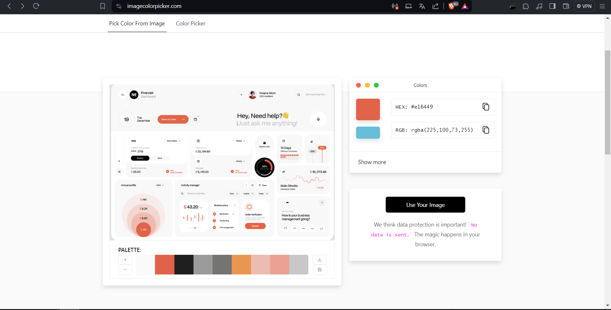

# Selección de Color

## Proceso de Extracción del Color Exacto

1. **Selección del Diseño Adecuado:**
   - Tras identificar el diseño que mejor se ajustaba a nuestras necesidades y objetivos para el proyecto de facturación, procedimos con el siguiente paso.

2. **Utilización de Image Color Picker:**
   - Para garantizar la precisión en la selección del color, optamos por utilizar la herramienta en línea Image Color Picker.
   - Esta herramienta nos permitió seleccionar con precisión cualquier color en la imagen y obtener su valor hexadecimal.

   

3. **Captura del Color Seleccionado:**
   - Utilizando Image Color Picker, seleccionamos cuidadosamente el color de la paleta que deseábamos incorporar en nuestro proyecto de facturación.
   - La herramienta nos proporcionó el código hexadecimal exacto del color seleccionado.

4. **Integración en el Proyecto:**
   - Con el código hexadecimal en mano, pudimos integrar fácilmente el color seleccionado en nuestra paleta de colores y aplicarlo de manera consistente en todo el diseño del facturador.

---

Este proceso meticuloso aseguró que pudiéramos mantener la coherencia visual y la precisión en la implementación del diseño seleccionado en nuestro proyecto de facturación. El uso de Image Color Picker facilitó la extracción del color exacto, lo que garantizará una experiencia visual cohesiva y atractiva para los usuarios.

