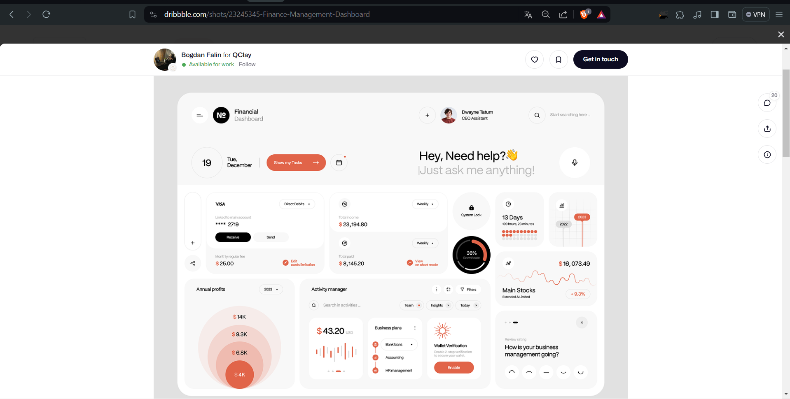
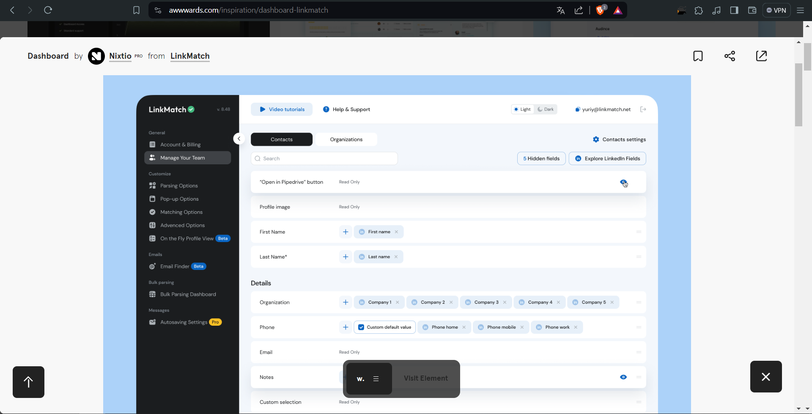
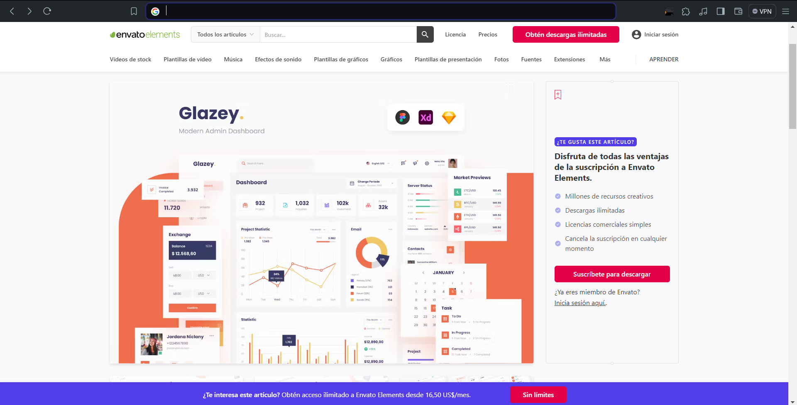

# Proceso de Búsqueda de Inspiración para el Facturador

### Exploración de Estilos de Diseño:
Para comenzar el proceso de diseño del facturador, nos embarcamos en una búsqueda exhaustiva de inspiración para establecer la dirección estética que deseábamos seguir.

### Búsqueda en Diversas Plataformas:
Iniciamos nuestra exploración en Google, utilizando términos específicos como "diseños de dashboard" para encontrar una amplia gama de ejemplos visuales.
Ampliamos nuestra búsqueda explorando diversas plataformas reconocidas por su contenido de diseño de calidad, incluyendo:

- **Dribbble**: Una plataforma que alberga una amplia variedad de diseños creativos compartidos por diseñadores de todo el mundo.
- **Figma**: Una herramienta de diseño colaborativo que también cuenta con una comunidad activa que comparte sus proyectos.
- **Design Shack**: Un sitio web que presenta artículos, recursos y ejemplos de diseño inspiradores.
- **Awwwards**: Una plataforma que premia y destaca los mejores diseños web del mundo, ofreciendo una gran fuente de inspiración.
- **Design Inspiration**: Un sitio web que ofrece una amplia selección de diseños creativos en diferentes categorías.

### Selección de una Paleta de Color Inspiradora:
Tras examinar numerosos diseños de dashboard en las diferentes plataformas, nos llamó la atención uno en particular que destacaba por su armoniosa paleta de colores.
Esta selección se basó en la coherencia visual, la estética general y la adecuación al tono y estilo que queríamos transmitir con nuestro facturador.
La paleta de colores de este diseño elegido se caracterizaba por describir la paleta de colores seleccionada, por ejemplo, tonos cálidos y terrosos, o una combinación fresca y moderna de azules y verdes.

